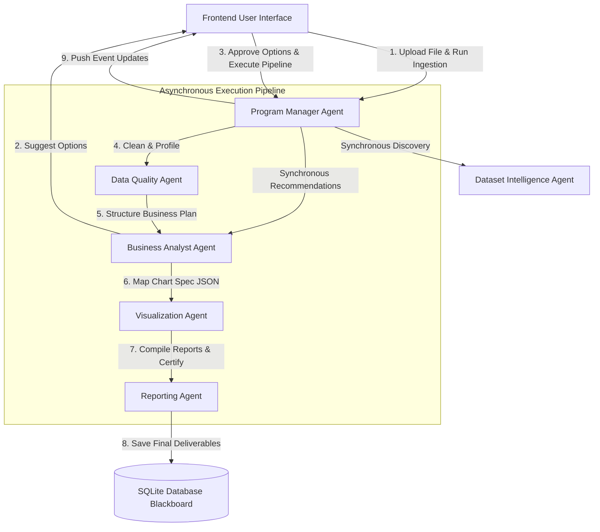

# exbi ai : Multi-Agent Analytics Platform 


**Exbi AI** is an asynchronous, multi-agent AI-powered data analytics consulting platform designed to simulate a real-world data science team. It enables users to upload datasets (CSV/Excel), automatically determines the business domain, recommends customized analysis paths, cleanses data, runs quality checks, designs interactive visualization specs, compiles professional markdown executive reports, and generates ready-to-download PDF and Word reports.

The platform is designed to operate seamlessly in both **Local LLM Mode** (via Ollama) and **Dual-Mode/Offline Fallback Mode** (via an Analytical heuristic template engine), making it highly reliable and inexpensive to deploy on cloud platforms (e.g., Render Free Tier).

---

##  Key System Features

1. **Dataset Discovery & Domain Autodetect**: Profiles dataset dimensions, null value densities, and column data types. It programmatically infers the target business domain (such as *Sales*, *HR*, *Customer Churn*, or *Operations*).
2. **Requirements Recommendation**: Dynamically generates tailored analytical roadmaps matching the identified business domain.
3. **Multi-Agent Blackboard Architecture**: Coordinated by a central Program Manager Orchestrator, a network of specialized agents communicate asynchronously using an SQLite database (`analytics_platform.db`) as a shared blackboard.
4. **Data Cleaning & Imputation**: Executes automated Pandas pipelines to drop duplicate records and impute missing variables.
5. **Business Constraint Checking**: Identifies business rule violations (e.g., negative values in sales or monthly incomes) and highlights statistical outliers.
6. **Chart.js Visualizations**: Automatically designs and constructs Chart.js specs (JSON) for interactive KPI cards, bar charts, trend lines, and pie charts.
7. **Automated Publishing**: Generates styled PDF reports (via ReportLab flowables) and Word documents (via python-docx) embedding backend-rendered Matplotlib charts.
8. **Recruiter Sandbox Mode**: Allows recruiters or guests to test the end-to-end pipeline instantly using pre-built mock datasets (Sales, HR) without needing local file uploads.

---

##  Detailed Folder Structure

The project layout is divided into a clean frontend-backend split:

```
Exbi AI/
├── index.html             # Main single-page application frontend interface
├── styles.css             # Unified application styles and glassmorphic dark-mode theme
├── app.js                 # Frontend orchestrator, AJAX requester, and Chart.js renderer
├── run.bat                # Batch file to configure environment and boot server
├── setup.bat              # Batch file to set up virtual environment and install packages
├── run.py                 # Python wrapper script to boot backend server
├── requirements.txt       # Python package list
├── render.yaml            # Render Cloud service blueprints
├── verify_redesign.py     # Backend test script verifying pipeline stages
├── backend/
│   ├── main.py            # FastAPI endpoints, routers, and CORS configurations
│   ├── settings.json      # LLM host and model configuration JSON
│   ├── database/          # SQLite database storage & SQLAlchemy ORM layer
│   │   ├── db_manager.py  # DB session creator & schemas (projects, agent_logs)
│   │   └── analytics_platform.db # SQLite database file (auto-generated)
│   ├── services/          # Analytical calculation and file compilation services
│   │   ├── data_engine.py      # Pandas & Matplotlib processing (cleaning, profiling)
│   │   ├── report_generator.py # File exporters (ReportLab PDF, python-docx Word)
│   │   └── llm_service.py      # LLM API connector & Analytical Fallback Engine
│   └── agents/            # Multi-Agent Framework classes
│       ├── base.py                 # Abstract base class for all agents
│       ├── orchestrator.py         # Program Manager Agent that directs execution flow
│       ├── dataset_intelligence.py  # Profiles schema, types, and identifies domains
│       ├── business_analyst.py     # Recommends targets and maps requirements
│       ├── data_quality.py         # Runs null/duplicate/outlier analysis and cleansing
│       ├── visualization_agent.py  # Generates visualization specs and plans layouts
│       ├── reporting_agent.py      # Authors executive summaries, reports, and QA checks
│       └── session_manager.py      # Handles data purging and session hygiene
```

---

##  The Multi-Agent Framework

The system utilizes an agent network coordinated by the **Program Manager Agent**. Each agent is built as a class inheriting from a common `BaseAgent` parent class, allowing structured logging and uniform API access.



### 1. Agent Personas & Responsibilities

| Agent Persona | Parent File | Key Responsibilities |
|---|---|---|
| **Program Manager Agent** *(Orchestrator)* | `orchestrator.py` | Initiates the pipeline, coordinates agent hand-offs, manages job states in the database, and reports real-time terminal logs to the frontend UI. |
| **Dataset Intelligence Agent** | `dataset_intelligence.py` | Conducts ingestion, detects file encoding/format, profiles table dimensions, and programmatically classifies columns into *Identifier*, *Boolean*, *Date*, *Numerical*, *Text*, or *Categorical*. |
| **Business Analyst Agent** | `business_analyst.py` | Analyzes business context and recommends tailored analyses. During Phase 2, maps selected analysis tasks to concrete business question frameworks. |
| **Data Quality Agent** | `data_quality.py` | Identifies duplicate records, calculates null density, executes Pandas-based cleaning (median/mode imputations), and flags outlier data violating business rules. |
| **Visualization Agent** | `visualization_agent.py` | Selects appropriate variables for charts, plans the grid layout, and constructs Chart.js JSON configurations for the frontend. |
| **Reporting Agent** | `reporting_agent.py` | Translates statistical metrics into structured markdown paragraphs, runs style/tone checks, and attaches a signed Governance Approval Certificate. |
| **Session Manager Agent** | `session_manager.py` | Deletes temporary uploads, charts, and database rows to maintain clean environment states. |

### 2. How the Agents Work: The Blackboard Pattern
Rather than using direct REST messaging between agents, the framework adopts the **Blackboard Pattern**:
- **Shared State**: All agents read from and write to the SQLite database `projects` and `agent_logs` tables.
- ** чёрный ящик (Blackboard)**: The `agent_logs` table acts as a global message log where agents write debug messages, intermediate decisions, and metadata.
- **Log Streaming**: The frontend regularly polls the `/api/logs/<project_id>` endpoint. This allows users to watch the agent department leaders "argue," discuss data quality rules, compile statistics, and sign off on dashboards in a mock console window.

---

##  LLM Integration & Dual-Mode Execution

### 1. Primary Model: Local Ollama (`llama3`)
By default, the `LLMService` is configured to communicate with a local **Ollama** server running on port `11434`. 
- **Model**: `llama3` (Default; can be configured to use `mistral`, `gemma`, `qwen`, or `phi` in `backend/settings.json`).
- **Mode**: Structured JSON generation (`format: json` parameter in Ollama API) is utilized heavily by the Dataset Discovery, Business Analyst, and Visualization agents to ensure data integrity during schema mapping.

### 2. Analytical Fallback Engine
To guarantee 100% uptime, zero API usage costs, and painless hosting on free-tier cloud environments, `llm_service.py` features a robust programmatic **Analytical Fallback Engine**:
- **Trigger**: Activated automatically if Ollama fails to respond or is offline.
- **Mechanism**: Performs data-driven structural mapping using deterministic heuristics:
  - Detects columns by keyword clustering (e.g., matching salary keywords to "HR", price keywords to "Sales").
  - Formulates structured JSON analysis specs dynamically based on actual Pandas dataset statistics.
  - Builds rich, domain-customized markdown reports featuring executive summaries, data quality writeups, and strategic actions.

---

Developer: Amaldev K M
- email: amaldev.connect@gmail.com
- website: https://amaldev-data.github.io/website/
- Project: exbi ai – Multi AI agent platform
